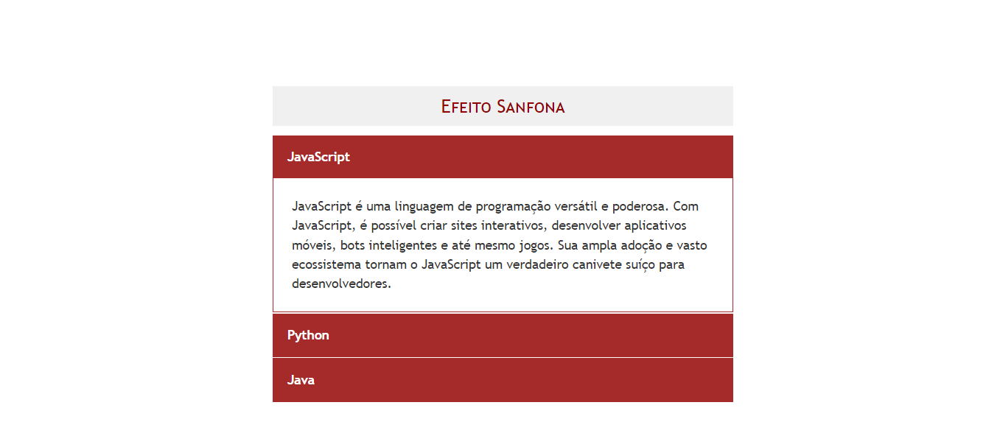
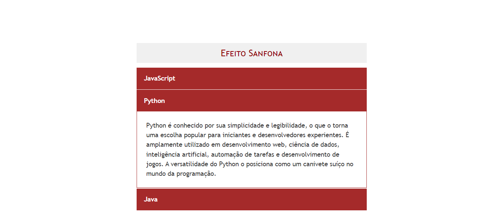
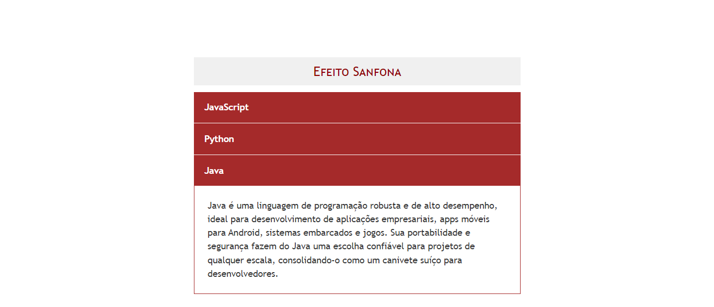

# EFEITO SANFONA COM JQUERY
👨‍🏫PROJETO CRIADO PARA O CURSO DE JQUERY.

  
  
  

## DESCRIÇÃO:
Este projeto "Efeito Sanfona" demonstra a utilização do jQuery para criar um menu interativo que expande e contrai suas seções ao clicar nos títulos. Além disso, inclui descrições detalhadas sobre as linguagens de programação JavaScript, Python e Java, destacando suas capacidades multifuncionais.

- **JavaScript**: Utilizado para criar sites interativos, aplicativos móveis, bots e jogos.
- **Python**: Amplamente usado em desenvolvimento web, ciência de dados, IA, automação e jogos.
- **Java**: Ideal para aplicações empresariais, apps Android, sistemas embarcados e jogos.

## NÃO SABE?
- Entendemos que para manipular arquivos em `HTML`, `CSS` e outras linguagens relacionadas, é necessário possuir conhecimento nessas áreas. Para auxiliar nesse aprendizado, oferecemos cursos gratuitos disponíveis:
* [CURSO DE HTML E CSS](https://github.com/VILHALVA/CURSO-DE-HTML-E-CSS)
* [CURSO DE JAVASCRIPT](https://github.com/VILHALVA/CURSO-DE-JAVASCRIPT)
* [CONFIRA MAIS CURSOS](https://github.com/VILHALVA?tab=repositories&q=+topic:CURSO)

## CREDITOS:
- [PROJETO CRIADO PARA O CURSO DE JQUERY](https://github.com/VILHALVA/CURSO-DE-JQUERY)
- [PROJETO FEITO PELO VILHALVA](https://github.com/VILHALVA)